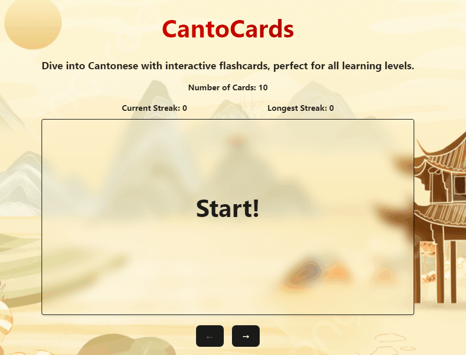
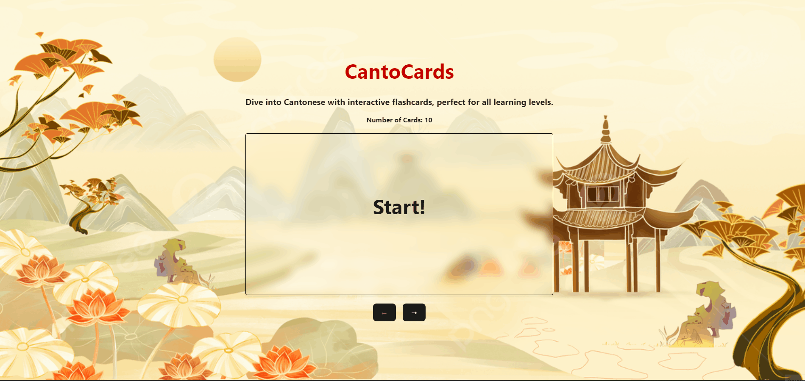
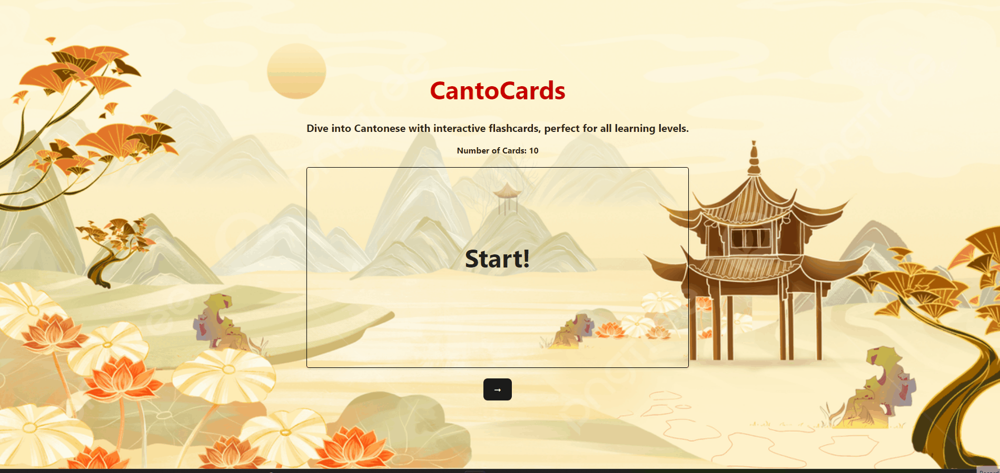

# Web Development Project 3 - CantoCards

Submitted by: Jason Tang

This web app: Tests Cantonese knowledge with interactive flashcards

Time spent: 6 hours spent in total

## Required Features

The following **required** functionality is completed:

- [ X] **The user can enter their guess in a box before seeing the flipside of the card**
- [ X] **Clicking on a submit button shows visual feedback about whether the answer was correct or incorrect**
- [ X] **A back button is displayed on the card and can be used to return to the previous card in a set sequence**
- [ X] **A next button is displayed on the card and can be used to navigate to the next card in a set sequence**

The following **optional** features are implemented:

- [ ] A shuffle button is used to randomize the order of the cards
- [ X] A user's answer may be counted as correct even when it is slightly different from the target answer
- [ X] A counter displays the user's current and longest streak of correct responses
- [ ] A user can mark a card that they have mastered and have it removed from the pool of answers as well as added to a list of mastered cards

The following **additional** features are implemented:

* [ X ] Made it so that the back button and the guess input box doesn't show on the Start card.

## Video Walkthrough

Here's a walkthrough of implemented user stories:

<!-- Replace this with whatever GIF tool you used! -->
GIF created with ScreenToGif
<!-- Recommended tools:
[Kap](https://getkap.co/) for macOS
[ScreenToGif](https://www.screentogif.com/) for Windows
[peek](https://github.com/phw/peek) for Linux. -->

## Notes

To implement the back button, I first thought I should save the state of the previous card. Whenver I pressed the next button, I would update the previous card state which ended up not working. When I pressed the back button again after going to the previous card, nothing would change since the previous card state was not set for that previous card. So then, I opted to save the state of all the previous cards as an array. Whenever I had to get the next card, the previous cards array would update to a new array containing everything plus the current card. The same thing goes if I press the back button; I would have to remove the the current card from the previous cards array.
I also had to do a lot of lifting up state in order to make my components refresh all their data whenever I press the navigation buttons. 

## License

    Copyright [2024] [Jason Tang]

    Licensed under the Apache License, Version 2.0 (the "License");
    you may not use this file except in compliance with the License.
    You may obtain a copy of the License at

        http://www.apache.org/licenses/LICENSE-2.0

    Unless required by applicable law or agreed to in writing, software
    distributed under the License is distributed on an "AS IS" BASIS,
    WITHOUT WARRANTIES OR CONDITIONS OF ANY KIND, either express or implied.
    See the License for the specific language governing permissions and
    limitations under the License.

# Web Development Project 2 - CantoCards

Submitted by: Jason Tang

This web app: Tests Cantonese knowledge with interactive flashcards

Time spent: 4 hours spent in total

## Required Features

The following **required** functionality is completed:

- [ X] **The title of the card set and some information about it, such as a short description and the total number of cards are displayed**
- [ X] **A single card at a time is displayed, only showing one of the components of the information pair**
- [ X] **A list of card pairs is created**
- [ X] **Clicking on the card shows the corresponding component of the information pair**
- [ X] **Clicking the next button displays a random new card**

The following **optional** features are implemented:

- [ X] Cards contains images in addition to or in place of text
- [ X] Cards have different visual styles such as color based on their category
  - [ X] Currently only shows different colors based on 2 difficulty levels

The following **additional** features are implemented:

* [ ] List anything else that you added to improve the site's functionality!

## Video Walkthrough

Here's a walkthrough of implemented required features:

<!-- Replace this with whatever GIF tool you used! -->
GIF created with ScreenToGif 
<!-- Recommended tools:
[Kap](https://getkap.co/) for macOS
[ScreenToGif](https://www.screentogif.com/) for Windows
[peek](https://github.com/phw/peek) for Linux. -->

## Notes
I was a bit confused on how I was going to implement the random card display. I initially thought of using a loop to go to a random
index in the array of objects containing my cards. Then, I looked at the Slack for some inspiration and had a lightbulb moment. My
solution was to first store the current card as a state object, and then for the randomize card function, I generated a random index to access my card array. Besides from that, I also had difficulties with styling the flip animations. It wasn't working out very well for me so I decided to scrap that feature. I'm satisfied with the final product.

## License

    Copyright [2024] [Jason Tang]

    Licensed under the Apache License, Version 2.0 (the "License");
    you may not use this file except in compliance with the License.
    You may obtain a copy of the License at

        http://www.apache.org/licenses/LICENSE-2.0

    Unless required by applicable law or agreed to in writing, software
    distributed under the License is distributed on an "AS IS" BASIS,
    WITHOUT WARRANTIES OR CONDITIONS OF ANY KIND, either express or implied.
    See the License for the specific language governing permissions and
    limitations under the License.
This template provides a minimal setup to get React working in Vite with HMR and some ESLint rules.

Currently, two official plugins are available:

- [@vitejs/plugin-react](https://github.com/vitejs/vite-plugin-react/blob/main/packages/plugin-react/README.md) uses [Babel](https://babeljs.io/) for Fast Refresh
- [@vitejs/plugin-react-swc](https://github.com/vitejs/vite-plugin-react-swc) uses [SWC](https://swc.rs/) for Fast Refresh
